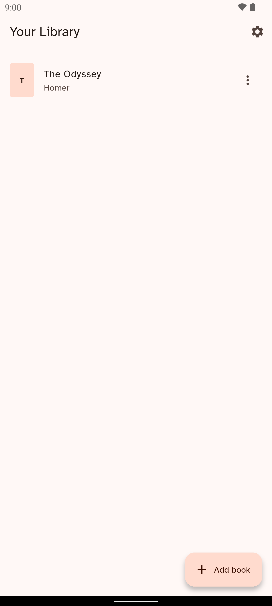
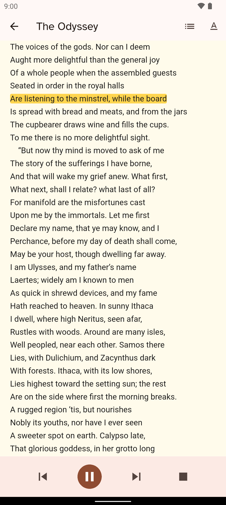
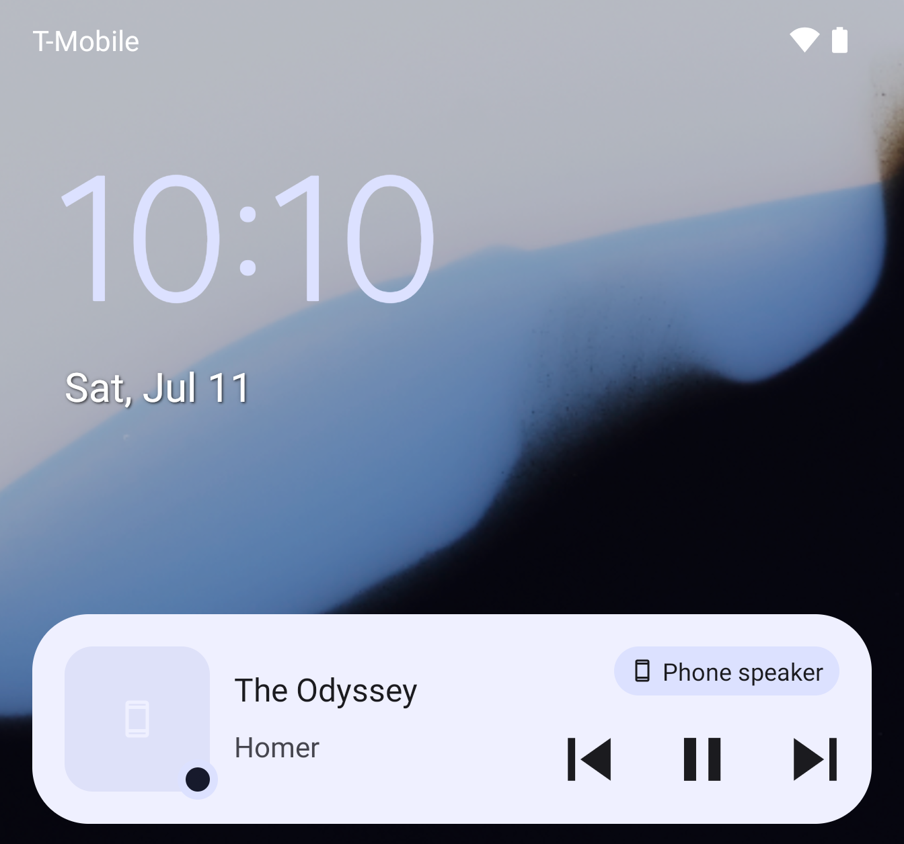

<div align="center">

# Narrarr 🎙️📖

### Immersion reading for the books you already own

**An on-device, offline AI voice reads your DRM-free EPUBs aloud while the text highlights in sync — free, private, and open-source.**

[](https://github.com/nikhilsutaria/Narrarr/releases/latest)
[](#-status)
[](#-roadmap)
[](https://flutter.dev)
[](#-private-by-design)
[](#-features)
[](LICENSE)

[**Features**](#-features) · [**How it works**](#-how-it-works) · [**Install**](#-getting-started) · [**Voices**](#-voices-ai-readers) · [**Roadmap**](#-roadmap) · [**Docs**](#-documentation)

</div>

---

Narrarr turns the **personal, DRM-free EPUBs you already own** into a Kindle-style *immersion reading* experience: the book is read aloud by an **on-device neural voice** while the **current sentence highlights in sync** and the page auto-follows — so your eyes can track along, or you can pocket your phone and just listen with full lock-screen controls.

> **The pitch:** your phone is already powerful enough to narrate a book locally. You shouldn't have to pay a subscription — or upload what you read — to listen to a book you already own.

---

## 📸 Screenshots

<div align="center">

| Library | Reading + sync highlight | Lock-screen controls |
|:---:|:---:|:---:|
|  |  |  |

_The current sentence highlights as the voice reads it (middle) — pocket your phone and keep control from the lock screen (right)._

</div>

---

## ✨ Features

- 🗣️ **Read-aloud with synced highlighting** — a natural neural voice narrates while the current sentence lights up and the page follows along automatically.
- 📴 **100% offline** — narration runs entirely on-device. The default voice is a one-time ~64 MB download on first play; after that, no network is needed for anything.
- 🆓 **Free & open-source** — no subscriptions, no accounts, no paywalls.
- 🔒 **Private by design** — your books and your reading never leave your phone.
- 🎧 **Listen anywhere** — background playback with lock-screen / notification media controls; put the phone away and keep listening.
- 👆 **Tap to jump** — tap any sentence to start narration from exactly there.
- 🎙️ **Optional higher-quality voices** — download extra voices on demand; they too run fully offline once installed.
- 📚 **Your library, your books** — import any DRM-free EPUB you own. Narrarr is a reader, not a bookstore.
- ♿ **Accessibility-first** — designed for dyslexia, low-vision, and print-disability readers, with the bundled [Atkinson Hyperlegible](https://brailleinstitute.org/freefont) font and adjustable size, spacing, and theme.

---

## 🔧 How it works

The whole-book read-aloud loop spans four cooperating layers, and one invariant makes the magic work without timers or guesswork:

> **`speak()` returns only when the audio for that sentence has actually finished playing.** The highlight advances when narration of sentence *i* completes, so it stays locked to the audio — perfectly, on any device.

```
EPUB  ─►  Segmenter        HTML → clean, narratable sentences
          (DOM-aware)      (drops nav, footnotes, captions, tables…)
            │
            ▼
        NarrationController  highlight sentence i → await its audio → advance to i+1
            │                (look-ahead pre-synthesis for gapless playback)
            ▼
        NeuralNarrator       sherpa-onnx + Piper, synthesized on a background isolate
            │                (long-sentence chunking · two-player ping-pong preload)
            ▼
        Reader + audio_service   synced highlight on screen · lock-screen controls
```

To keep narration smooth and gapless, the engine chunks long sentences on clause boundaries, pre-synthesizes the next chunk ahead of time, and hands off between two audio players so there's no silent gap between clips — all while the heavy text-to-speech FFI call runs on a persistent background isolate so the UI never janks.

---

## 🛠️ Tech stack

| Layer | What we use |
|---|---|
| **App** | [Flutter](https://flutter.dev) — one codebase for Android + iOS |
| **On-device TTS** | [sherpa-onnx](https://github.com/k2-fsa/sherpa-onnx) running [Piper](https://github.com/rhasspy/piper) neural voices |
| **EPUB render + highlight** | [Readium](https://readium.org) via `flutter_readium` |
| **Audio playback** | `audioplayers` + `audio_service` (background + lock-screen MediaSession) |
| **Library storage** | [Drift](https://drift.simonbinder.eu/) (SQLite) |
| **Sync highlighting** | Sentence-level, deterministic, and offline |

Voices are downloaded on demand (one-time, checksum-verified) and then run fully offline — which keeps the app itself a ~60 MB install.

---

## 🚦 Status

Narrarr **v1.0.0 is released** — a working, device-tested Android app with the full loop running end-to-end:

> import a DRM-free EPUB → read it in a real Readium reader → narrate it with an offline neural voice → **the current sentence highlights in sync and the page auto-follows** → background playback with lock-screen controls.

Verified on an Android emulator **and a real Pixel 8** (including EPUB import and on-demand voice download). iOS support and app-store / F-Droid distribution are still to come. Work is tracked as **[GitHub issues](../../issues)**.

---

## 🚀 Getting started

Two ways in: **install the prebuilt Android APK** (fastest), or **build from source**.

### 📲 Install on Android (prebuilt APK)

No toolchain needed — just download and install.

1. **[⬇️ Download from Releases »](https://github.com/nikhilsutaria/Narrarr/releases)** — open the newest release and grab the `Narrarr-…-arm64-v8a.apk` asset under **Assets** (~60 MB).
   - Built for **arm64-v8a** — effectively every Android phone from the last several years. (Not for x86 emulators; for those, build from source.)
2. Open the downloaded `.apk`. The first time, Android asks permission to **install unknown apps** — allow it for the app you downloaded with (**Settings → Apps → _your browser/files app_ → Install unknown apps → Allow**), then tap **Install**.
3. Launch Narrarr, import a DRM-free EPUB you own, and press play. The first narration downloads the default voice (one-time, ~64 MB, checksum-verified); everything runs fully offline after that.

> 💡 **Want a zero-setup demo?** Each release also has a `Narrarr-QA-…-arm64-v8a.apk` — a testing build with a sample book (*The Odyssey*) and the default voice pre-bundled, so the read-aloud loop works the moment it installs, no network needed. It installs side-by-side with the regular app as **"Narrarr QA"**.

> Narrarr is not yet on an app store — app-store / F-Droid distribution is on the [roadmap](#-roadmap).

### 🛠️ Build from source

#### Prerequisites

- [Flutter SDK](https://docs.flutter.dev/get-started/install) (Dart `^3.8`)
- **Android:** minSdk **24**, compileSdk **36**, NDK **27** (required by `sherpa_onnx` + `flutter_readium`)
- A connected Android device or emulator

#### Run it

```bash
git clone <this-repo-url>
cd Narrarr

flutter pub get                  # install dependencies
flutter run --flavor qa          # build & launch on your device/emulator
```

Narrarr builds in two **flavors**, and `--flavor` is required:

| Flavor | What you get |
|---|---|
| `qa` | The develop/demo build: a sample book (*The Odyssey*) and the default voice are **bundled**, so the read-aloud loop works immediately, fully offline. Installs side-by-side as **"Narrarr QA"**. |
| `prod` | The release build: clean library, no bundled voice (all voices download on demand) — the small APK that ships on the Releases page. |

#### Other useful commands

```bash
flutter analyze                       # lint
flutter test                          # run the test suite
flutter build apk --flavor prod       # release Android build (small, like the Releases page)
flutter build apk --flavor qa         # QA Android build (sample book + voice bundled)

# Regenerate Drift database code after editing lib/library/drift/
dart run build_runner build --delete-conflicting-outputs
```

---

## 🎙️ Voices (AI readers)

Narrarr narrates with on-device [Piper](https://github.com/rhasspy/piper) neural voices — natural-sounding and **fully offline once installed**. Voices are one-time, checksum-verified downloads (no account needed); **Amy (low)** is the default and is fetched automatically the first time you press play.

| Voice | Quality | Get it | Notes |
|---|---|---|---|
| **Amy (low)** | Good | Download (~64 MB) | English (US) · the default · auto-downloads on first play |
| **Amy (medium)** | Higher | Download (~64 MB) | English (US) · a richer take on the default voice |
| **Ryan (medium)** | Higher | Download (~64 MB) | English (US) · male voice |

> In the **QA build**, Amy (low) is pre-bundled inside the APK instead — narration works with no download at all.

### Download & switch voices

1. In the app, open **Settings** — the ⚙️ gear at the top-right of your library.
2. Tap **Voices** — _“Download, choose, and remove offline voices.”_
3. Tap a voice to **download** it (one-time, from the open [sherpa-onnx voice releases](https://github.com/k2-fsa/sherpa-onnx/releases/tag/tts-models) — no account). You’ll see download → verify → extract progress.
4. **Select** a downloaded voice to make it the active reader. Once installed it runs **100% offline**. Remove a voice anytime to reclaim space.

> All voices are English (US) for now. Want another language or voice? [Open an issue](../../issues) to request one.

---

## 🗺️ Roadmap

- ✅ EPUB import (DRM-free) + library
- ✅ Readium reader with font/size/spacing/theme
- ✅ Offline neural read-aloud (sherpa-onnx + Piper)
- ✅ Sentence-level synced highlighting + page auto-follow
- ✅ Background playback + lock-screen controls
- ✅ Download-on-demand higher-quality voices
- ✅ Small install (~60 MB): all voices — the default Amy included — download on demand (v1.0.0)
- 🔜 iOS support
- 🔜 App-store / F-Droid distribution

Have an idea or hit a bug? [Open an issue](../../issues) — that's how the roadmap grows.

---

## 📖 Documentation

In-depth research and rationale (market gap, feasibility, architecture, legal) lives in **[`docs/research/`](docs/research/README.md)**:

1. [Product Vision](docs/research/01-product-vision.md)
2. [Market & Competition](docs/research/02-market-competitive-analysis.md)
3. [Technical Feasibility](docs/research/03-technical-feasibility.md)
4. [Architecture & Stack](docs/research/04-architecture-and-stack.md)
5. [Risks, Legal & Compliance](docs/research/05-risks-legal-compliance.md)
6. [Sources](docs/research/sources.md)

---

## 🤝 Contributing

Contributions are welcome. Start with **[CONTRIBUTING.md](CONTRIBUTING.md)** for setup, conventions, and the PR process, then browse the **[issues list](../../issues)** — pick one up (look for `good first issue`), or open a new one to propose a feature or report a bug. A `flutter analyze` + `flutter test` run must pass before you submit changes.

---

## ⚖️ License & legal

- **License:** Narrarr is licensed under the **[GNU General Public License v3.0](LICENSE)**. This copyleft license fits the project's use of GPL-3.0 Piper tooling and keeps Narrarr (and any forks) free and open — see [Technical Feasibility](docs/research/03-technical-feasibility.md) and [Risks, Legal & Compliance](docs/research/05-risks-legal-compliance.md).
- Narrarr **only** opens DRM-free EPUBs you own. It does **not** remove DRM and is **not** a content store.
- The legal/compliance notes in the docs are good-faith research, **not legal advice**.

---

## 🙏 Acknowledgments

- [sherpa-onnx](https://github.com/k2-fsa/sherpa-onnx) and [Piper](https://github.com/rhasspy/piper) for on-device neural TTS
- [Readium](https://readium.org) and `flutter_readium` for EPUB rendering
- [Atkinson Hyperlegible](https://brailleinstitute.org/freefont) by the Braille Institute — accessible typography, free for everyone

<div align="center">

**Built for everyone who just wants to be read to — from the books they already own.**

</div>
